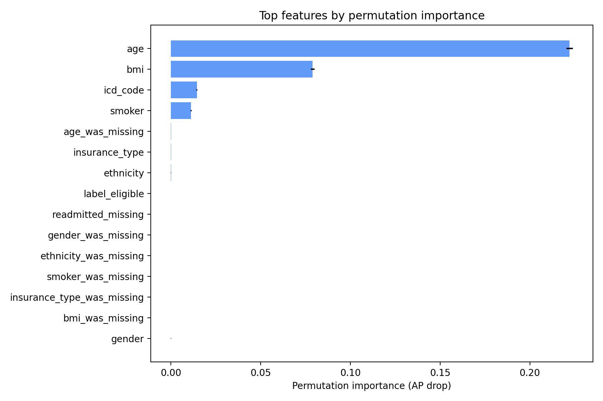

# Case Study: Deploying the Readmission Model

## What this project does
This repo builds and serves a 30‑day hospital readmission risk model from claims + patient data. It includes:
- A reproducible training pipeline (scikit‑learn) that prepares features, trains a gradient boosting model, and saves a portable bundle.
- Diagnostics and interpretability in the notebook (permutation importance, PDPs) to understand drivers of lift.
- A FastAPI service for real‑time scoring, plus Docker and Cloud Run configs for easy deployment.

### Most important features (validation permutation importance)
Below is an example view of the top drivers measured via permutation importance (Average Precision drop) on the validation split.



## Components
- Training script: `python -m readmission.train` produces `artifacts/model.joblib`.
- Batch scoring CLI: `python -m readmission.score_cli --input features.csv --output scores.csv`.
- FastAPI service: `uvicorn app.main:app --reload` exposes `/score` and `/healthz`.
- Containerization via Dockerfile.

## Quickstart (local)
1) Create and activate your Python env (or reuse the notebook env)
2) Install deps

    ```bash
    pip install -r requirements.txt
    ```

3) Train

    ```bash
    PYTHONPATH=src python -m readmission.train
    ```

4) Batch score (expects same feature columns as training)

    ```bash
    PYTHONPATH=src python -m readmission.score_cli --input data/claims.csv --output out/scores.csv
    ```

5) Serve API and test

    ```bash
    PYTHONPATH=src uvicorn app.main:app --host 0.0.0.0 --port 8000
    curl -X POST http://localhost:8000/score -H 'Content-Type: application/json' \
         -d '{"rows":[{"age":72,"bmi":33.5,"smoker":"Yes","icd_code":"J44.1"}]}'
    ```

## Container
- Build

    ```bash
    docker build -t case-study:latest .
    ```

- Run (after training, mount artifacts)

    ```bash
    docker run --rm -p 8000:8000 -v $(pwd)/artifacts:/app/artifacts case-study:latest
    ```

## Deploy to Google Cloud Run
1) Build and push image to Artifact Registry (or GCR)

    ```bash
    PROJECT_ID=$(gcloud config get-value project)
    REGION=us-central1
    REPO=case-study
    gcloud artifacts repositories create $REPO --repository-format=docker --location=$REGION --description="Case Study Model" || true
    docker build -t $REGION-docker.pkg.dev/$PROJECT_ID/$REPO/case-study:latest .
    gcloud auth configure-docker $REGION-docker.pkg.dev
    docker push $REGION-docker.pkg.dev/$PROJECT_ID/$REPO/case-study:latest
    ```

2) (Option A) Train locally and upload artifact to GCS

    ```bash
    gsutil mb -l $REGION gs://$PROJECT_ID-case-study-artifacts || true
    # After training: PYTHONPATH=src python -m readmission.train
    gsutil cp artifacts/model.joblib gs://$PROJECT_ID-case-study-artifacts/model.joblib
    ```

3) Deploy to Cloud Run

    ```bash
    gcloud run deploy case-study-api \
      --image $REGION-docker.pkg.dev/$PROJECT_ID/$REPO/case-study:latest \
      --region $REGION \
      --platform managed \
      --allow-unauthenticated \
      --set-env-vars MODEL_PATH=gs://$PROJECT_ID-case-study-artifacts/model.joblib
    ```

4) Test

    ```bash
    URL=$(gcloud run services describe case-study-api --region $REGION --format 'value(status.url)')
    curl "$URL/healthz"
    curl -X POST "$URL/score" -H 'Content-Type: application/json' \
         -d '{"rows":[{"age":72,"bmi":33.5,"smoker":"Yes","icd_code":"J44.1"}]}'
    ```

## Mirror Cloud Run locally (docker-compose)
1) Copy env file and edit as needed

    ```bash
    cp .env.example .env
    # Option A: local artifact
    # MODEL_PATH=artifacts/model.joblib
    # Option B: GCS artifact (requires a service account key at secrets/sa.json)
    # MODEL_PATH=gs://<bucket>/model.joblib
    ```

2) Train locally if using local artifact

    ```bash
    PYTHONPATH=src python -m readmission.train
    ```

3) Start the API

    ```bash
    docker compose up --build
    ```

4) Test

    ```bash
    curl http://localhost:8000/healthz
    curl -X POST http://localhost:8000/score -H 'Content-Type: application/json' \
         -d '{"rows":[{"age":72,"bmi":33.5,"smoker":"Yes","icd_code":"J44.1"}]}'
    ```

## Notes
- The training script mirrors the notebook’s data prep, grouped split, and HGB model.
- PDPs and interpretability live in the notebook; deploy pipeline only handles scoring.
- Ensure your scoring payload includes the same fields seen during training; unseen categories are handled.

## Tips
- If you prefer baking the model into the image, uncomment the RUN python -m readmission.train in the Dockerfile (and ensure data access during build).
- Cloud Run auto-injects PORT; the Dockerfile respects it. Set min/max instances and concurrency to control cost/latency.

## Additional notes
- For GCS access locally, place your service account JSON at `secrets/sa.json` and grant it read to the model object.
- `GOOGLE_APPLICATION_CREDENTIALS` is passed into the container for the GCS client.

## Refresh the feature-importance chart
- After training finishes, the pipeline saves `artifacts/feature_importance.png` and `artifacts/feature_importance.csv`.
- To publish in the README, copy the image into `docs/feature_importance.png` (tracked in git):

    ```bash
    cp artifacts/feature_importance.png docs/
    ```
